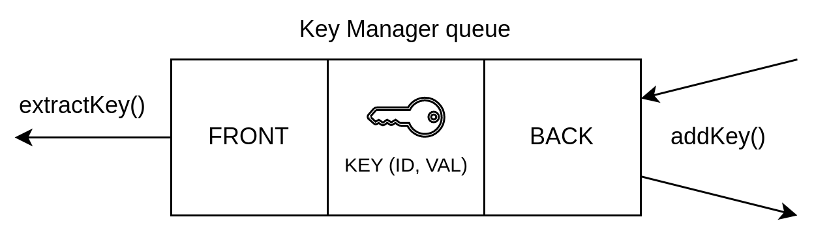

# QKD as a Service (QAAS) API

## Table of Contents:

- [QKD as a Service (QAAS) API](#qkd-as-a-service-qaas-api)
  - [Table of Contents:](#table-of-contents)
  - [Introduction](#introduction)
  - [QAAS client API](#qaas-client-api)
    - [0x01: `reserveKeyAndGetHalf` request](#0x01-reservekeyandgethalf-request)
    - [0xff: `reserveKeyAndGetHalf` response](#0xff-reservekeyandgethalf-response)
    - [0x02: `getKeyHalf` request](#0x02-getkeyhalf-request)
    - [0xfe: `getKeyHalf` response](#0xfe-getkeyhalf-response)
  - [QAAS admin API](#qaas-admin-api)
    - [0x03: `getState` request](#0x03-getstate-request)
    - [0xfd: `getState` response](#0xfd-getstate-response)
    - [0x04: `setState` request](#0x04-setstate-request)
    - [0xfc: `setState` response](#0xfc-setstate-response)
  - [Error codes \& State codes](#error-codes--state-codes)
  - [QAAS software structure \& operation](#qaas-software-structure--operation)
    - [Key Gathering](#key-gathering)
    - [Handling `reserveKeyAndGetHalf` requests](#handling-reservekeyandgethalf-requests)
    - [Handling `getKeyHalf` requests](#handling-getkeyhalf-requests)
    - [KDC Synchronisation](#kdc-synchronisation)

## Introduction

Every request and response is an ASN.1 DER encoded sequence of elements.
Each sequence element consists of its `type`, `length` and `value`.
The types and their respective encodings used in QAAS requests are:


| type              | encoding |
| ----------------- | -------- |
| SEQUENCE OF       | 0X30     |
| INTEGER           | 0X02     |
| OCTET ARRAY       | 0X04     |
| OBJECT IDENTIFIER | 0X06     |

The online ASN.1 javascript decoder might be helpful for debugging: [https://lapo.it/asn1js/](https://lapo.it/asn1js/).


## QAAS client API

- endpoint `reserveKeyAndGetHalf` reserves a new key from a KDC.

- endpoint `getKeyHalf` fetches a reserved key from the other KDC.

### 0x01: `reserveKeyAndGetHalf` request

| ordinal | parameter            | type    | description & notes                                |
| :-----: | -------------------- | ------- | -------------------------------------------------- |
|    0    | endpoint id = `0x01` | integer | Specifies the `reserveKeyAndGetHalf` request.      |
|    1    | key length = `256`   | integer | Currently only 256 byte key fetching is supported. |
|    2    | crypto nonce         | integer | Value should be random and between 0 and 2^63-1.   |

<details>
<summary>encoded request example</summary>

```
30 0b 02 01 01 02 02 01 00 02 02 30 39
```

explanation:

`30` `0b`: sequence type (`0x30`) with length `0x0b` = 11 bytes;

`02` `01` `01`: integer type (`0x02`) with length `0x01` = 1 bytes, value: `0x01` = 1; ( **endpoint id** )

`02` `02` `01 00`: integer type (`0x02`) with length `0x02` = 2 bytes, value: `0x0100` = 256; ( **key length** in bits )

`02` `02` `30 39`: integer type (`0x02`) with length `0x02` = 2 bytes, value: `0x3039` = 12345; ( **crypto nonce** )

</details>

### 0xff: `reserveKeyAndGetHalf` response

| ordinal | parameter            | type        | description & notes                                          |
| :-----: | -------------------- | ----------- | ------------------------------------------------------------ |
|    0    | error code           | integer     | See [Error codes \& State codes](#error-codes--state-codes). |
|    1    | response id = `0xff` | integer     | Specifies `reserveKeyAndHalf` response. `0xff` denotes -1.   |
|    2    | crypto nonce         | integer     | Requests' crypto nonce + 1.                                  |
|    3    | key identifier       | octet array |                                                              |
|    4    | key bytes first half | octet array |                                                              |
|    5    | other byte half hash | octet array |                                                              |
|    6    | hash algorithm id    | object id   |                                                              |

<details>

<summary>encoded response example:</summary>

```
30 5b 02 01 00 02 01 ff 02 02 30 3a 04 20 f0 ee 71 0b dd 47 79 3c b9 f6 a5 f1 af f4 2b 4d a4 24 28 6a 5c eb a2 91 f3 9e f1 16 96 57 af 14 04 10 8d cf be 25 0f 1c 06 6d 93 21 0d d0 2d a3 c4 d5 04 10 3d 53 11 a5 37 ba 6f 66 d2 ce 29 11 46 bb c1 ca 06 09 60 86 48 01 65 03 04 02 11
```

```
SEQUENCE (7 elem)
  INTEGER 0
  INTEGER -1
  INTEGER 12346
  OCTET ARRAY (32 byte) F0EE710BDD47793CB9F6A5F1AFF42B4DA424286A5CEBA291F39EF1169657AF14
  OCTET ARRAY (16 byte) 8DCFBE250F1C066D93210DD02DA3C4D5
  OCTET ARRAY (16 byte) 3D5311A537BA6F66D2CE291146BBC1CA
  OBJECT IDENTIFIER 2.16.840.1.101.3.4.2.17 shake128len (NIST Algorithm)
```

</details>

### 0x02: `getKeyHalf` request

| ordinal | parameter            | type        | description & notes                                |
| :-----: | -------------------- | ----------- | -------------------------------------------------- |
|    0    | endpoint id = `0x02` | integer     | Specifies the `getKeyHalf` request.                |
|    1    | key length = `256`   | integer     | Currently only 256 byte key fetching is supported. |
|    2    | key identifier       | octet array |                                                    |
|    3    | crypto nonce         | integer     | Value should be random and between 0 and 2^63-1.   |

<details>

<summary>encoded request example</summary>

```
30 2d 02 01 02 02 02 01 00 04 20 b6 0e a6 5c 0a 8e 55 2d 4e 24 3c 7b 93 ff 39 a5 82 94 f6 b9 a9 90 6f 70 90 24 52 2d 51 bf a2 c2 02 02 30 39
```

```
SEQUENCE (4 elem)
  INTEGER 2
  INTEGER 256
  OCTET ARRAY (32 byte) B60EA65C0A8E552D4E243C7B93FF39A58294F6B9A9906F709024522D51BFA2C2
  INTEGER 12345
```

</details>

### 0xfe: `getKeyHalf` response

| ordinal | value                 | type        | description & notes                                          |
| :-----: | --------------------- | ----------- | ------------------------------------------------------------ |
|    0    | error code            | integer     | See [Error codes \& State codes](#error-codes--state-codes). |
|    1    | response id = `0xfe`  | integer     | Specifies the `getKeyHalf` response. `0xfe` denotes -2.      |
|    2    | crypto nonce          | integer     | Requests' crypto nonce + 1.                                  |
|    3    | key bytes second half | octet array |                                                              |
|    4    | other byte half hash  | octet array |                                                              |
|    5    | hash algorithm id     | object id   |                                                              |


<details>

<summary>encoded response example:</summary>

```
30 39 02 01 00 02 01 fe 02 02 30 3a 04 10 7a 5b f1 09 30 bd 83 7d a7 4e 71 64 10 00 c0 6f 04 10 69 c3 cb f2 b7 98 59 ab 69 17 d3 76 d4 d3 9d df 06 09 60 86 48 01 65 03 04 02 11
```

```
SEQUENCE (6 elem)
  INTEGER 0
  INTEGER -2
  INTEGER 12346
  OCTET ARRAY (16 byte) 7A5BF10930BD837DA74E71641000C06F
  OCTET ARRAY (16 byte) 69C3CBF2B79859AB6917D376D4D39DDF
  OBJECT IDENTIFIER 2.16.840.1.101.3.4.2.17 shake128len (NIST Algorithm)
```

</details>

## QAAS admin API

- `getState` is used to determine the state and key identifiers of the first even and odd parity keys respectively.

- `setState` is used to set the state of kdc and synchronize keys.

### 0x03: `getState` request

| ordinal | parameter           | type    | description & notes                              |
| :-----: | ------------------- | ------- | ------------------------------------------------ |
|    0    | endoint id = `0x03` | integer | Specifies the `getState` request.                |
|    1    | crypto nonce        | integer | Value should be random and between 0 and 2^63-1. |

<details>
<summary>encoded request example:</summary>

```
30 07 02 01 03 02 02 30 39
```

```
SEQUENCE (2 elem)
  INTEGER 3
  INTEGER 12345
```

</details>

### 0xfd: `getState` response

| ordinal | value                | type        | description & notes                                          |
| :-----: | -------------------- | ----------- | ------------------------------------------------------------ |
|    0    | error code           | integer     | See [Error codes \& State codes](#error-codes--state-codes). |
|    1    | response id = `0xfd` | integer     | Specifies the `getState` response. `0xfd` Denotes -3.        |
|    2    | crypto nonce         | integer     | Requests' crypto nonce + 1.                                  |
|    3    | KDC state code       | integer     | See [Error codes \& State codes](#error-codes--state-codes). |
|    4    | currently stored     | integer     | The size of key queue.                                       |
|    5    | currently reservable | integer     | No. of keys with KDC's respective parity.                    |
|    6    | keys served in total | integer     |                                                              |
|    7    | keys added in total  | integer     |                                                              |
|    8    | oldest even key id   | octet array |                                                              |
|    9    | oldest odd key id    | octet array |                                                              |

<details>
<summary>encoded response example</summary>
```
30 62 02 01 00 02 01 fd 02 02 30 3a 02 01 02 02 03 01 86 a0 02 02 c2 b1 02 01 04 02 03 06 19 a3 04 20 fc 77 92 ac 49 de 6d 4d 84 1c f7 52 38 5a f0 c5 75 04 78 4e 07 89 19 33 cf c2 65 53 84 9a 48 83 04 20 8e 11 ff 8e 87 44 0b 04 2c 5d a8 06 b8 b5 e0 f8 6d ab 7a 33 33 48 81 7b 3b 59 44 6e 39 64 4d fc
```

```
SEQUENCE (10 elem)
  INTEGER 0
  INTEGER -3
  INTEGER 12346
  INTEGER 2
  INTEGER 100000
  INTEGER -15695
  INTEGER 4
  INTEGER 399779
  OCTET ARRAY (32 byte) FC7792AC49DE6D4D841CF752385AF0C57504784E07891933CFC26553849A4883
  OCTET ARRAY (32 byte) 8E11FF8E87440B042C5DA806B8B5E0F86DAB7A333348817B3B59446E39644DFC
```

</details>

### 0x04: `setState` request

| ordinal | parameter           | type        | description & notes                              |
| :-----: | ------------------- | ----------- | ------------------------------------------------ |
|    0    | endoint id = `0x04` | integer     | Specifies the `getState` request.                |
|    1    | state code          | integer     | Either 0 (stop and clear all keys) or 2 (start). |
|    2    | oldest even key id  | octet array |                                                  |
|    3    | oldest odd key id   | octet array |                                                  |
|    4    | crypto nonce        | integer     | Value should be random and between 0 and 2^63-1. |

<details>
<summary>encoded request example</summary>

```
30 4e 02 01 04 02 01 00 04 20 83 24 d2 59 d6 0f 0b 13 0e b0 c7 49 a9 67 62 02 d4 e1 41 cc 60 be 81 6e 1a 82 53 29 57 62 3a 03 04 20 47 97 af ff 7d 36 13 e6 c6 94 9d 8f 2e 42 4e 15 27 aa 77 66 18 4f f0 cb 36 07 09 83 13 76 21 83 02 02 30 39
```

```
SEQUENCE (5 elem)
  INTEGER 4
  INTEGER 0
  OCTET ARRAY (32 byte) 8324D259D60F0B130EB0C749A9676202D4E141CC60BE816E1A82532957623A03
  OCTET ARRAY (32 byte) 4797AFFF7D3613E6C6949D8F2E424E1527AA7766184FF0CB3607098313762183
  INTEGER 12345
```

</details>

### 0xfc: `setState` response

| ordinal | value                | type    | description & notes                                          |
| :-----: | -------------------- | ------- | ------------------------------------------------------------ |
|    0    | error code           | integer | See [Error codes \& State codes](#error-codes--state-codes). |
|    1    | response id = `0xfc` | integer | Specifies the `setState` response. `0xfc` Denotes -4.        |
|    2    | crypto nonce         | integer | Requests' crypto nonce + 1.                                  |

<details>
<summary>encoded response example</summary

```
30 0a 02 01 00 02 01 fc 02 02 30 3a
```

```
SEQUENCE (3 elem)
Offset: 0
Length: 2+10
(constructed)
Value:
(3 elem)
  INTEGER 0
  INTEGER -4
  INTEGER 12346
```

</details>

## Error codes & State codes

| error code | description & notes                                          |
| :--------: | ------------------------------------------------------------ |
|     0      | No error.                                                    |
|     1      | Key not found.                                               |
|     2      | KDC is not running.                                          |
|     3      | Internal error.                                              |
|     4      | Invalid request.                                             |

| state code | description & notes                                          |
| :--------: | ------------------------------------------------------------ |
|     0      | KDC is not running.                                          |
|     1      | KDC is receiving keys.                                       |
|     2      | KDC is running.                                              |

## QAAS software structure & operation



### Key Gathering

TODO

### Handling `reserveKeyAndGetHalf` requests

TODO

### Handling `getKeyHalf` requests

TODO

### KDC Synchronisation

TODO
